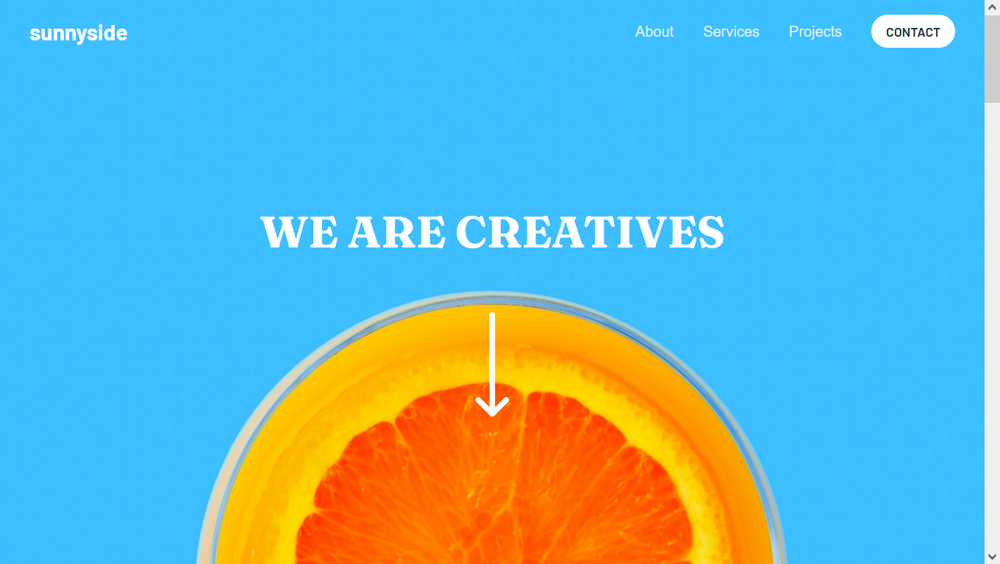

# Frontend Mentor - Sunnyside agency landing page solution

This is a solution to the [Sunnyside agency landing page challenge on Frontend Mentor](https://www.frontendmentor.io/challenges/sunnyside-agency-landing-page-7yVs3B6ef). Frontend Mentor challenges help you improve your coding skills by building realistic projects.

## Table of contents

- [Overview](#overview)
  - [The challenge](#the-challenge)
  - [Screenshot](#screenshot)
  - [Links](#links)
- [My process](#my-process)
  - [Built with](#built-with)
  - [What I learned](#what-i-learned)
  - [Useful resources](#useful-resources)
- [Author](#author)

## Overview

### The challenge

Users should be able to:

- View the optimal layout for the site depending on their device's screen size
- See hover states for all interactive elements on the page

### Screenshot



### Links

- Solution URL: [code-source](https://github.com/DMikaia/sunnyside-agency)
- Live Site URL: [demo](https://sunnyside-agency-sage.vercel.app/)

## My process

### Built with

- [Astro](https://docs.astro.build/en/)
- [React](https://reactjs.org/) - JS library

### What I learned

I've found a fun way to add svg elements and be able to change their colors without copying the whole svg. The only drawback is that it only works with a specific pattern of the element.

See the code snippets below:

```astro
<div class="flex gap-8 tablet:gap-4 tv:gap-8 justify-center items-center">
  {socials.map(social => (
    <svg width={social.width} height={social.height} xmlns="http://www.w3.org/2000/svg">
      <path  d={social.d} fill="#2C7566" "fill-rule"="non-zero" />
    </svg>
  ))}
</div>
```

### Useful resources

- [Stackoverflow](https://stackoverflow.com)
- [Astro docs](https://docs.astro.build/fr/getting-started/)

## Author

- Frontend Mentor - [@dmikaia](https://www.frontendmentor.io/profile/dmikaia)
